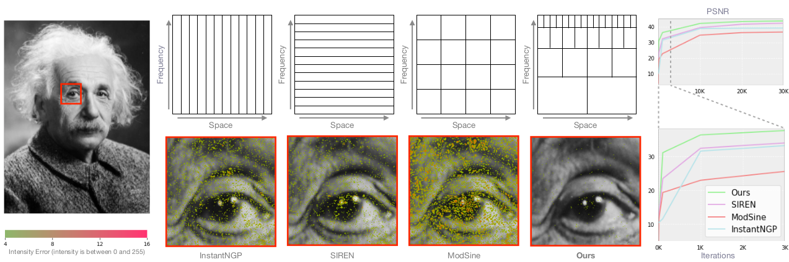
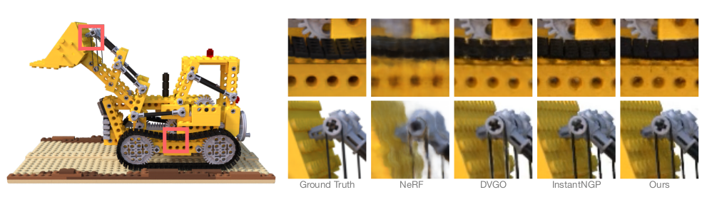
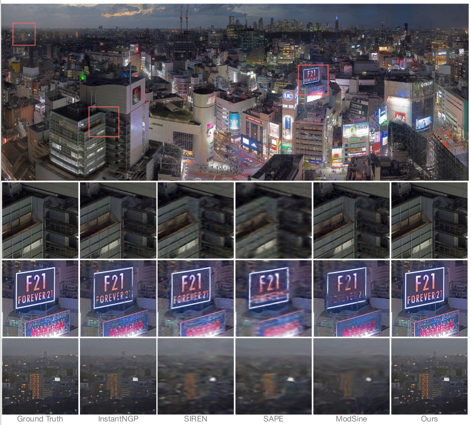
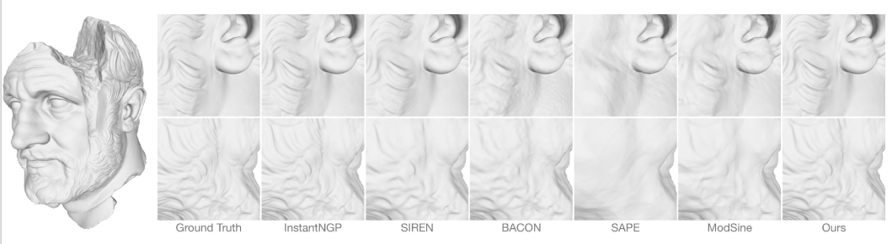

# Neural Fourier Filter Bank

> Notice: Still reorganizing and consolidating codes...The current repo only contains the training and inference parts for NeRF. 
> Codes for 2D fitting and 3D fitting, together with the CUDA implementations will be released afterwards.  

This repository contains the code (in [PyTorch Lightning](https://www.pytorchlightning.ai/index.html)) for the paper:

[__Neural Fourier Filter Bank__](https://arxiv.org/abs/2212.01735)
<br>
[Zhijie Wu](https://zhijiew94.github.io/), [Yuhe Jin](https://scholar.google.ca/citations?user=oAYi1YQAAAAJ&hl=en), [Kwang Moo Yi](https://www.cs.ubc.ca/~kmyi/)
<br>
CVPR 2023


## Introduction

In this project, we propose to learn a neural field by decomposing the signal both spatially and frequency-wise.
We follow the grid-based paradigm for spatial decomposition, but unlike existing work, encourage specific frequencies to be stored in each grid via Fourier feature encodings.
We then apply a multi-layer perceptron with sine activations, taking these Fourier encoded features in at appropriate layers so that higher-frequency components are accumulated on top of lower-frequency components sequentially, which we sum up to form the final output.
We do the evaluations in the tasks of 2D image fitting, 3D shape reconstruction, and neural radiance fields.
All results are tested upon an Nvidia RTX 3090. 

If you have any questions, please feel free to contact Zhijie Wu (wzj.micker@gmail.com).




## Key Requirements
- Python 3.8
- CUDA 11.6
- [PyTorch 1.12.0](https://www.tensorflow.org/)
- [PyTorch Lightning](https://www.pytorchlightning.ai/index.html)
- [torch-scatter](https://github.com/rusty1s/pytorch_scatter#installation)
- [apex](https://github.com/NVIDIA/apex#linux)
- [tiny-cuda-nn](https://github.com/NVlabs/tiny-cuda-nn#pytorch-extension)
- Install requirements by `pip install -r requirements.txt`

> Note: Our current implementations are heavily based on the [ngp-pl](https://github.com/kwea123/ngp_pl) repo. 
> For further details, please also refer to their codebase.


## Novel View Synthesis


A quickstart:
```bash
--root_dir <path/to/lego> --exp_name Lego --num_epochs 30 --lr 2e-2 --eval_lpips --no_save_test
```
It will train the Lego scene for 30k steps. `--no_save_test` is to disable saving synthesized images.

More options can be found in `opt.py` and `FFB_config.json` under the `config` folder.

To compute the metrics for the eight Blender scenes, please run the script `benchmark_synthetic_nerf.sh` under the folder `benchmarking`.


## 2D Image Fitting


> Codes to be released


## 3D Shape Fitting


> Codes to be released


## Citation and License

```
@misc{wu2022neural,
      title={Neural Fourier Filter Bank}, 
      author={Zhijie Wu and Yuhe Jin and Kwang Moo Yi},
      year={2022},
      eprint={2212.01735},
      archivePrefix={arXiv}
}
```

Our codebase is under the MIT License.


## TODO

- [ ] Finish the CUDA version
- [ ] Release codes for 2D image fitting & 3D shape reconstruction

